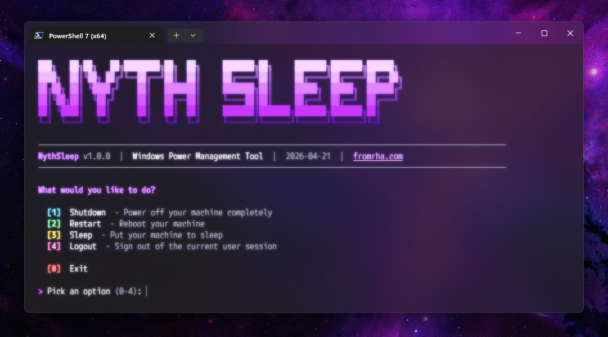

# Nythsleep

Cross-platform terminal power management. Schedule shutdown, restart, sleep,
logout, battery-triggered actions, or temporary Keep Awake mode.

## Supported systems

| System | Actions | Keep Awake | Battery | Notifications |
| --- | --- | --- | --- | --- |
| Windows 10/11 | Yes | Yes | Yes | Yes |
| Linux with systemd | Yes | Yes | Yes | Yes, with `notify-send` |
| macOS | Yes | Yes | Yes | Yes |

Linux support is session-manager neutral. Nythsleep uses systemd `loginctl` and
`systemd-inhibit`, so it works with KDE, GNOME, Hyprland, and other graphical
sessions. Logout only targets current active graphical session; it refuses
ambiguous or non-graphical sessions.

## Install globally

Use [`pipx`](https://pipx.pypa.io/). It installs isolated executable shims and
keeps `nythsleep` plus `nsleep` available globally without administrator access.

```bash
pipx install git+https://github.com/fromrha/nythsleep.git
pipx ensurepath
```

Open new terminal after `pipx ensurepath`. It adds pipx executable directory to
user `PATH`; then run:

```bash
nythsleep --help
nsleep --version
```

Install local clone while developing:

```bash
pipx install . --force
pipx ensurepath
```

Windows batch wrappers remain for existing clones. New installs should use
`pipx` on every supported OS.

### Linux packages

CachyOS/Arch includes required `loginctl` and `systemd-inhibit` through systemd.
Install `libnotify` for desktop notifications:

```bash
sudo pacman -S libnotify python-pipx
```

## Usage

```bash
nythsleep                    # interactive mode
nythsleep --sleep -t 30m     # confirm, then sleep in 30 minutes
nythsleep --shutdown -b 15   # confirm, then shut down at 15% battery
nythsleep --insomnia -t 2h   # keep system awake for two hours
nythsleep --restart --yes    # unattended restart: no prompt
```

### Actions

| Flag | Meaning |
| --- | --- |
| `-s`, `--shutdown` | Power off |
| `-r`, `--restart` | Reboot |
| `-z`, `--sleep` | Suspend |
| `-l`, `--logout` | Sign out current graphical session |
| `-t`, `--timer` | Timer: `1h 30m`, `45m`, `10s` |
| `-i`, `--insomnia` | Keep Awake mode; accepts `--timer` |
| `-b`, `--battery` | Trigger action at `1` through `100` percent |
| `-y`, `--yes` | Skip destructive-action confirmation |
| `--theme` | `lavender`, `midnight`, `sunset`, `forest` |

> [!WARNING]
> Power actions can discard unsaved work. Flags now prompt for confirmation.
> Use `--yes` only in deliberate unattended scripts.

## Development

```bash
python -m unittest discover -s tests -v
python -m py_compile src/nythsleep.py src/platforms.py
```

## License

MIT. See [LICENSE](LICENSE).
